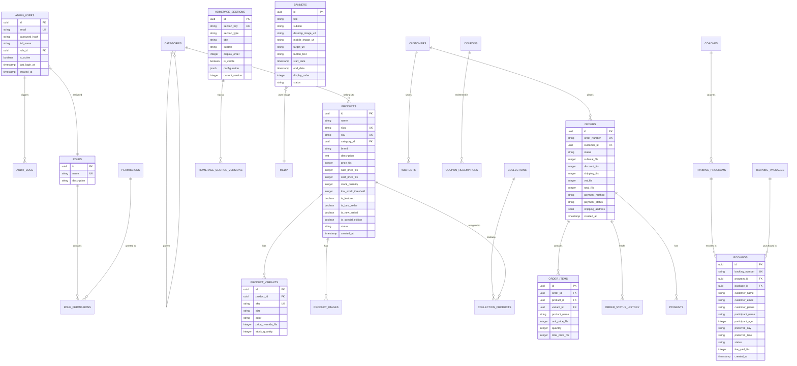

# STRATEGY Control Center — Phase 2: System Architecture, Database ERD & REST API Specifications

> **System:** STRATEGY Public Web App + Admin Control Center  
> **Brand:** STRATEGY — Premium Sportswear, Carbon-Plated Footwear, Sports Equipment & Sports Academies  
> **Deployment Target:** Netlify Static Web App + Netlify Serverless Functions / Supabase PostgreSQL API Layer

---

## 1. Stack Selection & Architecture Overview

### Selected Technology Stack
1. **Database & Storage & Authentication:**
   - **PostgreSQL Database** (hosted on Supabase / Neon): Scalable relational data store supporting strict constraints, foreign keys, JSONB metadata, and money stored as integer fils (`1 AED = 100 fils`).
   - **Row Level Security (RLS) & JWT Auth**: Role-Based Access Control (RBAC) enforced at database and API layers.
   - **Storage Buckets**: Media library storage for responsive images, WebP assets, and campaign videos.

2. **Backend API Layer:**
   - **Netlify Serverless Functions / Node.js Express REST API**: Serverless `/api/v1/...` REST endpoints with CORS control, rate limiting, Argon2/bcrypt password hashing, Zod schema validation, and error envelopes.

3. **Admin Control Center (Frontend App):**
   - **React 18 + Vite + TypeScript**: Strict type safety across modules.
   - **Tailwind CSS**: Matching STRATEGY brand design tokens (Primary Blue `#3b4cca`, Dark Navy `#030718`, White, Soft Slate `#f8fafc`).
   - **TanStack Query (React Query v5)**: Automated server-state management, optimistic updates, and instant caching.
   - **React Hook Form + Zod**: Schema-based form validation.
   - **dnd-kit**: Drag-and-drop reordering for Homepage Sections, Banners, and Navigation.
   - **Recharts**: Executive KPI charts and analytics visualizations.

4. **Public Web Site Integration:**
   - **Preserved Public Frontend**: Keeps existing React framework and styling untouched.
   - **API Data Client (`src/services/api.js`)**: Fetches published data live from REST API endpoints with fallback cache and skeleton loading state.

---

## 2. Database Schema ERD (Entity Relationship Diagram)



---

## 3. Project Directory & Module Blueprint

```
/c:/Users/4nsuu/scating page/
├── /src                              # Existing Public Site (Refactored Data Layer)
│   ├── /components                   # Preserved Public UI Components
│   ├── /data                         # Seed & Local Fallback Data
│   ├── /services                     # API Client Data Layer (api.js)
│   ├── App.jsx
│   └── main.jsx
├── /admin                            # STRATEGY Control Center Admin App
│   ├── /src
│   │   ├── /components               # Reusable Admin UI Components
│   │   │   ├── DataTable.tsx
│   │   │   ├── Modal.tsx
│   │   │   ├── FormInputs.tsx
│   │   │   ├── StatsCard.tsx
│   │   │   ├── StatusBadge.tsx
│   │   │   ├── ConfirmDialog.tsx
│   │   │   ├── ImageUploader.tsx
│   │   │   ├── PermissionGate.tsx
│   │   │   └── Skeleton.tsx
│   │   ├── /layouts                  # Admin Layouts (Sidebar, Header, Shell)
│   │   │   └── AdminLayout.tsx
│   │   ├── /modules                  # Feature Modules
│   │   │   ├── /dashboard            # KPI metrics & Sales Charts
│   │   │   ├── /products             # Product CRUD, Variants, Bulk Edit, Import/Export
│   │   │   ├── /categories           # Category Tree & Reordering
│   │   │   ├── /collections          # Manual & Rule Collections
│   │   │   ├── /homepage             # Drag-and-Drop Homepage Sections
│   │   │   ├── /banners              # Banner & Campaign Manager
│   │   │   ├── /orders               # Order Fulfillment & Invoice Generator
│   │   │   ├── /customers            # Customer Directory
│   │   │   ├── /coupons              # Discount Codes & Offers
│   │   │   ├── /academy              # Programs, Coaches, Packages, Enquiries
│   │   │   ├── /reviews              # Moderation Workflow
│   │   │   ├── /navigation           # Navbar & Footer Menu Builder
│   │   │   ├── /settings             # Storefront Rules, Shipping, VAT, Gateways
│   │   │   ├── /users                # Admin User RBAC Management
│   │   │   └── /audit                # System Audit Logs
│   │   ├── /hooks                    # React Query Custom Hooks
│   │   ├── /services                 # Axios API Service Layer
│   │   ├── /types                    # Shared TypeScript Interfaces
│   │   ├── App.tsx
│   │   └── main.tsx
├── /backend                          # Serverless REST API Functions
│   ├── /controllers                  # Business Logic Controllers
│   ├── /middleware                   # Auth, RBAC, Rate-Limiting, Error Envelopes
│   ├── /models                       # Data Access Layer / SQL Helpers
│   ├── /validators                   # Zod Schema Validators
│   └── /utils                        # JWT, Logger, Currency Helpers
├── /database                         # Database Infrastructure
│   ├── /schema                       # PostgreSQL Table Schema DDL
│   ├── /migrations                   # Versioned SQL Migrations
│   └── /seed                         # Seed Script (Imported from Existing Site Data)
├── /shared                           # Shared TypeScript Types & Permissions Matrix
├── /docs                             # Phase Architecture & API Specs
├── package.json
└── vite.config.js
```

---

## 4. REST API Endpoint Specifications

All API responses strictly adhere to the standard JSON envelope:

```json
{
  "success": true,
  "data": {},
  "meta": {
    "page": 1,
    "limit": 20,
    "total": 100
  },
  "error": null
}
```

### 4.1 Public Endpoints (Cached, Read-Only, Published Content Only)
- `GET /api/v1/public/storefront/init` — Initial storefront bundle (settings, categories, navigation, banners).
- `GET /api/v1/public/homepage` — Published homepage section sequence and configuration.
- `GET /api/v1/public/banners` — Currently active published banners (filtered by start/end date).
- `GET /api/v1/public/products` — Product catalog (filters: `category`, `gender`, `sport`, `special`, `search`, `sort`, `page`).
- `GET /api/v1/public/products/:slug` — Single published product details, variants, and gallery.
- `GET /api/v1/public/categories` — Published category hierarchy.
- `GET /api/v1/public/collections` — Active collections and assigned items.
- `GET /api/v1/public/programs` — Active academy training programs.
- `GET /api/v1/public/coaches` — Published coach profiles.
- `GET /api/v1/public/faqs` — Published FAQ items.
- `GET /api/v1/public/reviews` — Approved reviews only.
- `POST /api/v1/public/cart/price` — Server-side calculation of cart subtotal, discount, VAT, shipping fee, and free shipping progress.
- `POST /api/v1/public/orders` — Idempotent order placement (COD / Gateway).
- `POST /api/v1/public/enquiries` — Public academy trial booking / enquiry submission.
- `POST /api/v1/public/reviews` — Submit review for approval.

### 4.2 Admin Endpoints (Auth + RBAC Required)
- `POST /api/v1/admin/auth/login` — Authenticate admin user, issue HttpOnly JWT cookies.
- `POST /api/v1/admin/auth/logout` — Revoke token & clear session.
- `GET /api/v1/admin/auth/me` — Return current admin profile & permissions.
- `GET /api/v1/admin/dashboard/kpis` — Return real-time dashboard KPIs and revenue charts.
- `GET /api/v1/admin/products` — Full product list with draft/archived status and stock alerts.
- `POST /api/v1/admin/products` — Create new product with variants.
- `PUT /api/v1/admin/products/:id` — Update product details and inventory.
- `DELETE /api/v1/admin/products/:id` — Soft-delete or archive product.
- `PUT /api/v1/admin/products/bulk` — Inline bulk stock/price edit.
- `GET /api/v1/admin/categories` — CRUD for category tree.
- `PUT /api/v1/admin/homepage/reorder` — Update drag-and-drop section sequence.
- `GET /api/v1/admin/orders` — Orders list with filter by status, date, payment.
- `PUT /api/v1/admin/orders/:id/status` — Update order fulfillment status.
- `GET /api/v1/admin/academy/bookings` — Manage academy registrations and enquiries.
- `GET /api/v1/admin/audit-logs` — Immutable system audit log records.

---

## 5. Cache Strategy & Revalidation Blueprint

To guarantee zero performance degradation on Netlify:
1. **Public Read Queries**: Cached with `Cache-Control: public, max-age=60, s-maxage=300, stale-while-revalidate=86400`.
2. **On-Demand Revalidation**: When an admin updates a product, banner, or homepage section, the backend triggers a cache invalidation signal (`purge` hook or ETag match), ensuring updates reflect on the public site immediately.
3. **Draft / Preview Mode**: Admin users can supply a preview token `?preview=true` to view draft sections before publishing.

---

## Phase 2 Deliverable Summary
- **Selected Stack**: Supabase/PostgreSQL + Netlify Serverless Functions + React/TypeScript Admin + Shared REST API.
- **Database Architecture**: 18 PostgreSQL tables with strict constraints, foreign keys, UUIDs, integer fils money storage, and audit logs.
- **API Specification**: Standardized envelope REST API with separate cached Public and secure RBAC Admin routes.

---
*Ready for Phase 3: Database Schema, SQL Migrations & Seed Script.*
